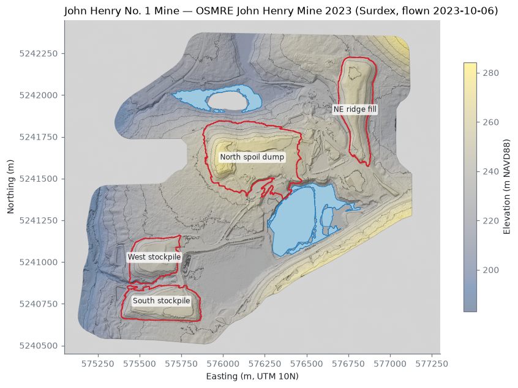
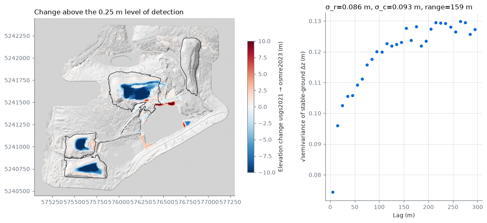

# John Henry Mine lidar volumes, 2021 vs 2023

A LiDAR / point-cloud processing example using the John Henry Mine, King County,
Washington, USA. A Python was used workflow to measure the mine's spoil piles and
how they changed between 2021 and 2023. The 2023 lidar is distributed by
OpenTopography and the 2021 lidar by the USGS 3D Elevation Program.

Volumes of the spoil dumps and stockpiles at the **John Henry No. 1 Mine**, a
reclaimed surface coal mine near Black Diamond, Washington, measured from
airborne lidar point clouds, with an uncertainty on every number.

The pipeline goes from raw points to volumes: it fetches the point clouds,
removes noise, classifies ground, builds a TIN terrain model, detects and
flattens the pit lakes, finds each pile's toe, interpolates the ground
beneath it, integrates the volume and propagates the errors. It also
differences two surveys to measure change. Every step is scripted, tested
against shapes with known volumes, and reproducible with one command.

## Results



### Pile volumes (October 2023 survey)

Volume above the reconstructed ground, from the OSMRE 2023 survey (0.5 m
DTM). The ± is a 95 % interval covering the base-surface interpolator, a
±2 m toe tolerance and survey error. The 2021 column uses the same toe
polygons on the USGS 3DEP 2021 survey.

| Feature | 2023 volume (m³) | ± 95 % (m³) | 2021 volume (m³) | Footprint (ha) | Max height 2023 (m) |
|---|---:|---:|---:|---:|---:|
| North spoil dump | 2,456,000 | 284,000 | 3,022,000 | 21.0 | 31.9 |
| NE ridge fill | 1,141,000 | 131,000 | 1,146,000 | 10.0 | 24.5 |
| South stockpile | 1,016,000 | 120,000 | 1,273,000 | 8.8 | 25.8 |
| West stockpile | 739,000 | 103,000 | 920,000 | 6.9 | 22.9 |
| **Total** | **5,351,000** | **351,000** | **6,361,000** | 46.8 | |

### What changed between 2021 and 2023



About **1.14 million m³ was cut** from the flat tops of three dumps, lowering
them by up to ~10 m. About 0.19 million m³ of fill is visible, mostly as new
ground along the pit-lake shore. The rest presumably went below the water
line, where lidar cannot see. The NE ridge did not change. This fits
reclamation earthworks that push spoil back into the flooded pit.

| Region | Cut (m³) | Fill (m³) | Net (m³) |
|---|---:|---:|---:|
| Whole site (excl. lakes) | 1,135,000 ± 22,000 | 189,000 ± 23,000 | −946,000 |
| North spoil dump | 603,000 ± 10,000 | 34,000 ± 6,000 | −569,000 |
| South stockpile | 262,000 ± 7,000 | 14,000 ± 3,400 | −248,000 |
| West stockpile | 188,000 ± 5,000 | 18,000 ± 3,800 | −170,000 |
| NE ridge fill | 500 | 1,800 | +1,300 |

### Checks that the numbers hold together

* **Two independent routes agree.** The drop in each pile's volume between
  the surveys (2021 minus 2023, each measured against its own base surface)
  matches the directly differenced change: North 566k vs 569k m³,
  South 257k vs 248k, West 182k vs 170k, NE ridge 5k vs −1k. The DoD figures
  are slightly smaller because changes under the 0.25 m detection limit are
  zeroed.
* **The toes are reproducible.** Toes proposed independently from the 2021 and
  2023 surveys overlap by 96–99 % (intersection over union).
* **Grid independence.** Coarsening the 2023 DTM from 0.5 m to 1 m changes each
  volume by 0.4–0.7 %.
* **Survey agreement.** On stable ground the two surveys differ by a
  +7.5 cm datum offset (removed) with 9 cm random and 9 cm correlated
  (≈160 m range) noise, which gives the 0.25 m level of detection.
* **Known answers.** Cones, paraboloids and a synthetic cut/fill scenario are
  recovered to within 0.5 % (`tests/`).

### Caveats

* **The toe matters most.** These dumps were graded into the hillside, so
  where the pile "ends" is a judgement. Across plausible toe placements the
  volumes move by up to ±20 % (toe sweep in `results/SUMMARY.md`), which is
  larger than the stated ±. The toe polygons are committed in
  `data/features/toes.geojson` so the definition is explicit and can be
  changed.
* **Pit lake.** The main pit is flooded (12.1 ha at 230.49 m NAVD88 in 2023).
  Lidar does not penetrate water, so neither the pit's submerged volume nor
  the spoil pushed below the water line can be measured.
* **No pre-mining surface.** Mining started in 1986, before any lidar, so the
  total excavation relative to original ground is not measured here.

## Quick start

```bash
conda env create -f environment.yml     # PDAL + Python stack from conda-forge
conda activate minevol
make test                               # analytic volume tests, ~5 s
make all                                # fetch → process → volumes → change → report
```

`make all` downloads roughly 1.5 GB of point cloud and takes 30–60 minutes on
a laptop. Outputs go to `results/`, which is committed so you can read the
results without running anything; `results/SUMMARY.md` is the generated
report.

Stages can be run on their own:

```bash
minevol fetch usgs2021        # USGS 3DEP 2021, streamed from AWS (Entwine Point Tiles)
minevol fetch osmre2023       # OSMRE 2023 survey from OpenTopography's bulk bucket
minevol process osmre2023     # clean, classify, TIN DTM, water flattening
minevol toes osmre2023        # propose toe polygons from the search outlines (review, then commit)
minevol volumes osmre2023     # feature volumes + uncertainty ensemble
minevol change                # 2021 → 2023 cut/fill with level of detection
minevol report                # figures + results/SUMMARY.md
make smrf-check               # re-classify ground with SMRF and compare
```

## How it works

```
LAS/LAZ or EPT ─► crop + reproject ─► noise filter ─► ground (vendor | SMRF)
      (PDAL)            EPSG:6339        classes 7/18,      │
                                         statistical        ▼
                                         outlier       Delaunay TIN ─► DTM raster
                                                            │         (faceraster)
                              water returns (class 9) ─► lake extent + level ─► hydro-flatten
                                                            │
   search outline ─► toe detection ─► reviewed toe polygon ─► base surface ─► ∫(z − base) dA
                     (iterative, harmonic)                   (harmonic | TIN)       │
                                                                                    ▼
                               ensemble over base method × toe tolerance + survey error ─► V ± σ
```

The full method, with the reasoning behind each choice, is in
[`docs/method.md`](docs/method.md). The short version:

* **DTM from a TIN, not binned points.** Ground returns are triangulated and
  the TIN is rasterised, so every cell is an exact interpolation between real
  returns, including under canopy.
* **Base surface by harmonic interpolation.** The ground under a pile is
  reconstructed by solving Laplace's equation inside the toe with the
  surrounding terrain as boundary. It reproduces any sloping plane exactly
  and never overshoots the rim. A classic toe-to-toe TIN is computed
  alongside it.
* **Toes proposed automatically, then committed.** A deliberately loose
  outline is shrunk iteratively to the slope break. The resulting polygon
  (`data/features/toes.geojson`) is reviewed against the hillshade and becomes
  the auditable definition of each feature.
* **Uncertainty with two terms.** One is the base-surface ensemble
  (interpolator × ±2 m toe tolerance). The other is survey error propagated
  with spatial correlation (Rolstad et al. 2009), with parameters taken from a
  variogram of the 2021→2023 difference on stable ground.
* **Verified on shapes with known volumes.** Cones and paraboloids on sloping
  ground are recovered to within 0.5 % (`tests/`), and a synthetic change
  test recovers a known datum shift, fill and cut.

## Repository layout

```
config/john_henry.yaml     all site, survey and method parameters
data/features/             search outlines and reviewed toe polygons (GeoJSON, EPSG:6339)
src/minevol/
  pointcloud.py            PDAL pipelines: fetch (EPT, S3), clean, SMRF, TIN DTM
  water.py                 lake extent/level from water returns, hydro-flattening
  reference.py             base surfaces: harmonic, TIN, thin-plate spline
  volume.py                cut/fill integration, toe detection
  uncertainty.py           error propagation, co-registration, variograms
  workflow.py, cli.py      stages and the `minevol` command
  report.py                figures and results/SUMMARY.md
results/                   generated tables, figures and the exact PDAL pipelines used
tests/                     analytic and synthetic end-to-end tests
docs/method.md             method, assumptions and limitations
```

## Data and credits

* **2023:** *Lidar Survey of John Henry Mine, WA 2023*, U.S. DOI Office of
  Surface Mining Reclamation and Enforcement, acquired by Surdex, distributed
  by OpenTopography. <https://doi.org/10.5069/G93F4MVH> (CC BY 4.0).
* **2021:** USGS 3D Elevation Program, *WA_KingCo_1_2021*, via the
  [USGS 3DEP Entwine Point Tiles](https://registry.opendata.aws/usgs-lidar/)
  public dataset on AWS.

Code is MIT-licensed (see `LICENSE`).
