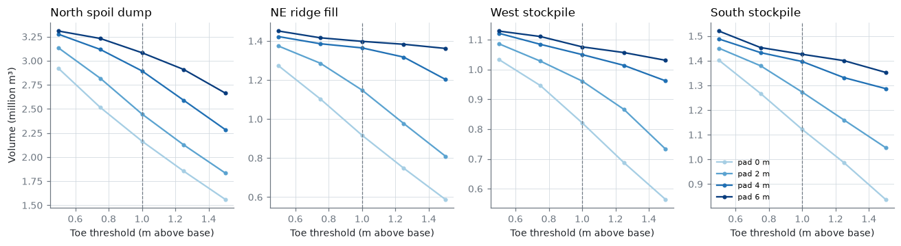
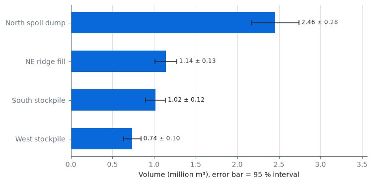
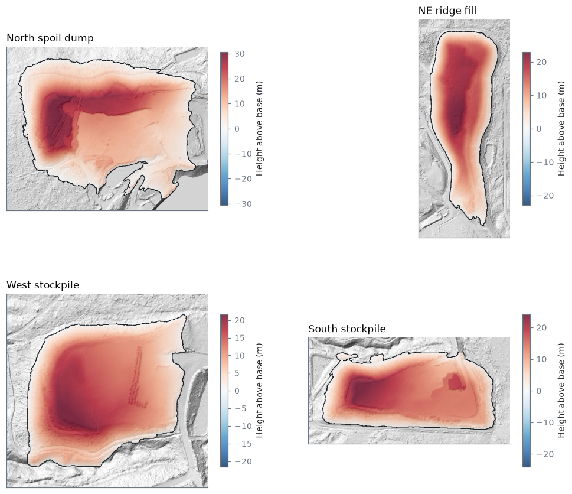

# Results — John Henry No. 1 Mine

Generated by `minevol report`. Volumes in cubic metres; ± is the 95 % interval (1.96 σ). See `docs/method.md` for how each number is produced.

## USGS 3DEP King County 2021 (QL1)

| Feature | Volume (m³) | ± 95 % (m³) | Footprint (m²) | Max height (m) | Ground pts/m² | Base share of σ |
|---|---:|---:|---:|---:|---:|---:|
| North spoil dump | 3,021,934 | 235,844 | 209,677 | 35.7 | 3.2 | 100% |
| NE ridge fill | 1,145,862 | 125,719 | 100,295 | 24.6 | 1.8 | 100% |
| West stockpile | 920,235 | 91,848 | 69,391 | 34.1 | 3.3 | 100% |
| South stockpile | 1,272,538 | 113,398 | 88,432 | 33.5 | 3.1 | 100% |
| **Total** | **6,360,569** | 304,504 | | | | |

Grid-resolution check (central volume, m³):

| Feature | 1 m | 2 m | 5 m |
|---|---:|---:|---:|
| NE ridge fill | 1,145,862 | 1,162,007 | 1,192,249 |
| North spoil dump | 3,021,934 | 3,045,250 | 3,069,416 |
| South stockpile | 1,272,538 | 1,284,498 | 1,299,679 |
| West stockpile | 920,235 | 928,949 | 936,752 |

Water bodies ≥ 0.5 ha (surface level from lidar water returns):

| Area (ha) | Level (m NAVD88) | IQR of returns (m) |
|---:|---:|---:|
| 11.26 | 230.52 | 0.03 |
| 3.25 | 203.96 | 0.03 |
| 1.73 | 230.43 | 0.06 |
| 1.10 | 220.28 | 0.03 |
| 0.70 | 204.20 | 0.10 |

How much the volume depends on where the toe is drawn (not part of the ± above; see docs/method.md):

## OSMRE John Henry Mine 2023 (Surdex, flown 2023-10-06)

| Feature | Volume (m³) | ± 95 % (m³) | Footprint (m²) | Max height (m) | Ground pts/m² | Base share of σ |
|---|---:|---:|---:|---:|---:|---:|
| North spoil dump | 2,455,938 | 283,884 | 209,677 | 31.9 | 10.0 | 100% |
| NE ridge fill | 1,140,594 | 131,376 | 100,295 | 24.5 | 3.1 | 100% |
| West stockpile | 738,672 | 102,556 | 69,391 | 22.9 | 10.9 | 100% |
| South stockpile | 1,015,950 | 120,309 | 88,432 | 25.8 | 7.9 | 100% |
| **Total** | **5,351,155** | 350,488 | | | | |

Grid-resolution check (central volume, m³):

| Feature | 0.5 m | 1 m | 2.5 m |
|---|---:|---:|---:|
| NE ridge fill | 1,140,593 | 1,148,091 | 1,163,773 |
| North spoil dump | 2,455,942 | 2,465,440 | 2,481,869 |
| South stockpile | 1,015,951 | 1,021,562 | 1,030,730 |
| West stockpile | 738,671 | 743,294 | 751,475 |

Water bodies ≥ 0.5 ha (surface level from lidar water returns):

| Area (ha) | Level (m NAVD88) | IQR of returns (m) |
|---:|---:|---:|
| 12.11 | 230.49 | 0.02 |
| 3.36 | 204.23 | 0.02 |

How much the volume depends on where the toe is drawn (not part of the ± above; see docs/method.md):

## Change usgs2021 → osmre2023

Co-registration shift removed: +0.074 m (NMAD 0.101 m on 1,184,907 stable cells). Level of detection: 0.25 m.

| Region | Fill (m³) | Cut (m³) | Net (m³) |
|---|---:|---:|---:|
| whole site | 189,015 ± 22,957 | 1,135,200 ± 21,855 | -946,185 |
| North spoil dump | 33,638 ± 4,227 | 603,007 ± 9,765 | -569,369 |
| NE ridge fill | 1,824 ± 818 | 525 ± 292 | 1,298 |
| West stockpile | 17,652 ± 2,921 | 187,907 ± 3,749 | -170,255 |
| South stockpile | 14,366 ± 2,689 | 262,134 ± 5,012 | -247,769 |

