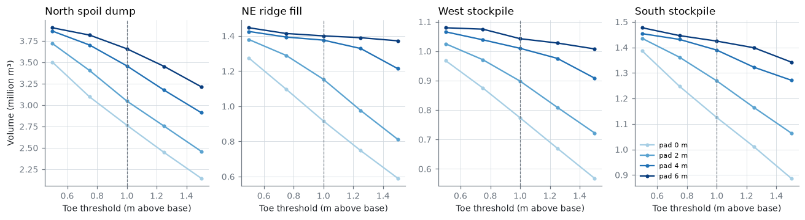
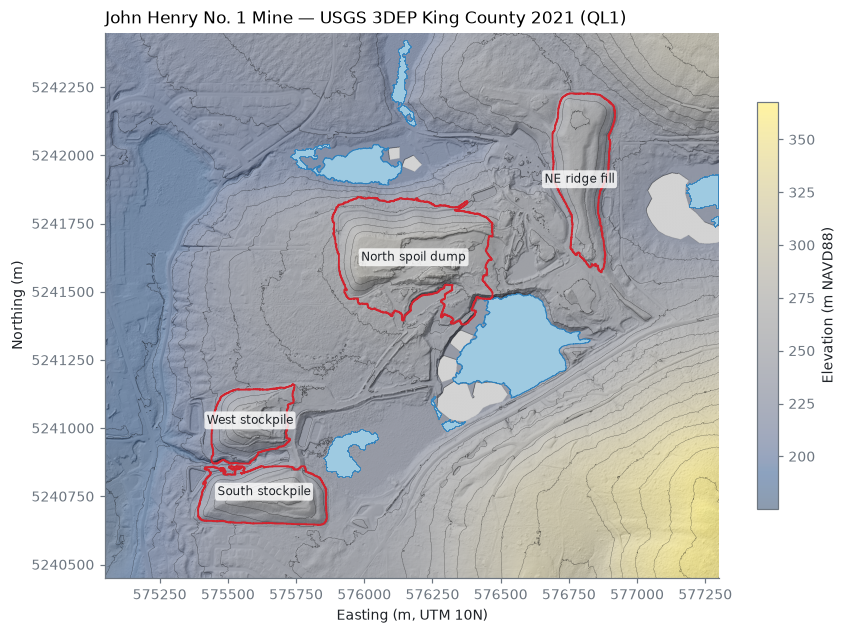
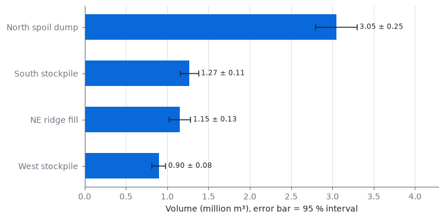
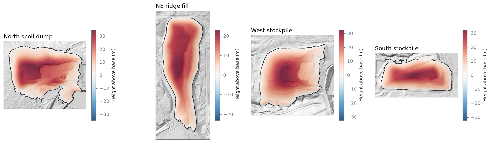

# Results — John Henry No. 1 Mine

Generated by `minevol report`. Volumes in cubic metres; ± is the 95 % interval (1.96 σ). See `docs/method.md` for how each number is produced.

## USGS 3DEP King County 2021 (QL1)

| Feature | Volume (m³) | ± 95 % (m³) | Footprint (m²) | Max height (m) | Ground pts/m² | Base share of σ |
|---|---:|---:|---:|---:|---:|---:|
| North spoil dump | 3,046,011 | 251,755 | 206,798 | 35.7 | 3.0 | 100% |
| NE ridge fill | 1,153,386 | 128,830 | 100,447 | 24.6 | 1.0 | 100% |
| West stockpile | 898,327 | 83,241 | 67,196 | 33.8 | 3.0 | 100% |
| South stockpile | 1,268,801 | 110,260 | 88,426 | 33.5 | 3.0 | 100% |
| **Total** | **6,366,525** | 314,745 | | | | |

Grid-resolution check (central volume, m³):

| Feature | 1 m | 2 m | 5 m |
|---|---:|---:|---:|
| NE ridge fill | 1,153,386 | 1,171,652 | 1,200,862 |
| North spoil dump | 3,046,011 | 3,067,269 | 3,081,532 |
| South stockpile | 1,268,801 | 1,280,706 | 1,296,850 |
| West stockpile | 898,327 | 907,521 | 917,759 |

Water bodies ≥ 0.5 ha (surface level from lidar water returns):

| Area (ha) | Level (m NAVD88) | IQR of returns (m) |
|---:|---:|---:|
| 10.35 | 230.52 | 0.03 |
| 2.82 | 203.96 | 0.03 |
| 1.73 | 230.43 | 0.06 |
| 1.10 | 220.28 | 0.03 |
| 0.70 | 204.20 | 0.10 |

How much the volume depends on where the toe is drawn (not part of the ± above; see docs/method.md):

